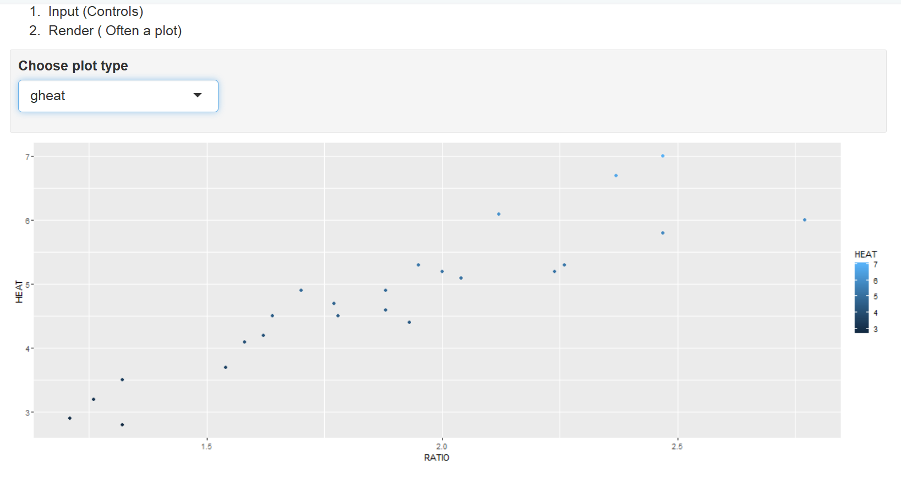

```{r setup, include=FALSE}
knitr::opts_chunk$set(echo = TRUE)
```

# Task 1

WD

```{r}
getwd()
```

# Task 2

```{r}
spruce.df = read.csv("SPRUCE.csv")
names(spruce.df)[names(spruce.df) == "ï..BHDiameter"] <- "BHDiameter"
head(spruce.df)
```

# Task 3

Scatter Plot of the data.
```{r}
with(spruce.df,  {
plot(Height~BHDiameter,bg="Blue",pch=21, cex=1.2, ylim=c(0,max(Height)*1.1),xlim=c(0,max(BHDiameter)*1.1), xlab="BHDiameter", ylab="Height", main="Height vs BHDiameter")
 }
)
```

There exists a possibility for a straight line relationship.

Loess Plots:

```{r}
library(s20x)
with(spruce.df,  {
  layout(matrix(1:3,nr=3))
  trendscatter(Height~BHDiameter,f=0.5, data=spruce.df, main="f=0.5")
  trendscatter(Height~BHDiameter,f=0.6, data=spruce.df, main="f=0.6")
  trendscatter(Height~BHDiameter,f=0.7, data=spruce.df, main="f=0.7")
  }
)
```

Creating the linear model

```{r}
spruce.lm=with(spruce.df, lm(Height~BHDiameter))
```

Creating the scatter plot with the abline

```{r}
with(spruce.df,
plot(Height~BHDiameter,bg="Blue",pch=21,ylim=c(0,1.1*max(Height)),xlim=c(0,1.1*max(BHDiameter)))
)
abline(spruce.lm)
```

To see if the straight line is appropriate, I would look calculate a fit statistic, or the R-Squared value for the straight line.

```{r}
summary(spruce.lm)
```

As we can see, the straight line has an R-Squared value of .6569, low, but not too bad.  Calculating a fit statistic for loess is impossible, but it does look like the curves fit the data quite nicely.

#Task 4

Making the 4 plots:
```{r}
layout(matrix(1:4,nr=2,nc=2,byrow=TRUE))
layout.show(4)

#plot 1
with(spruce.df,
  plot(Height~BHDiameter,bg="Blue",pch=21,ylim=c(0,1.1*max(Height)),xlim=c(0,1.1*max(BHDiameter)))+abline(spruce.lm)
)
mtext("Scatter Plot",side=3)

# make a linear model
spruce.lm=with(spruce.df, lm(Height~BHDiameter))

#make a new plot
with(spruce.df,
     plot(Height~BHDiameter, bg="Blue",pch=21,ylim=c(0,1.1*max(Height)),xlim=c(0,1.1*max(BHDiameter)))
)
abline(spruce.lm)


#plot 2


#make yhat the estimates of E[Height | BHDiameter]
yhat=with(spruce.df,predict(spruce.lm,data.frame(BHDiameter)))
#OR you could use -- (yhat values the predicted values for all the BHDiameter values )
yhat=fitted(spruce.lm)

# Draw in segments making the residuals (regression deviations)
with(spruce.df,{
segments(BHDiameter,Height,BHDiameter,yhat)
})
abline(spruce.lm)

#residual sum of squares
RSS=with(spruce.df,sum((Height-yhat)^2))

RSS
mtext("RSS Plot",side=3)
#make a new plot
with(spruce.df,
plot(Height~BHDiameter, bg="Blue",pch=21,ylim=c(0,1.1*max(Height)),xlim=c(0,1.1*max(BHDiameter)))
)

#make nieve model
with(spruce.df, abline(h=mean(Height)))
abline(spruce.lm)
mtext("MSS Plot",side=3)

#make the explained deviations (explained by the model)
with(spruce.df, segments(BHDiameter,mean(Height),BHDiameter,yhat,col="Red"))
MSS=with(spruce.df,sum((yhat-mean(Height))^2))
MSS

# Total  error
#make a new plot

with(spruce.df,
plot(Height~BHDiameter, bg="Blue",pch=21,ylim=c(0,1.1*max(Height)),xlim=c(0,1.1*max(BHDiameter)))
)
with(spruce.df,abline(h=mean(Height)))
with(spruce.df, segments(BHDiameter,Height,BHDiameter,mean(Height),col="Green"))
mtext("TSS Plot",side=3)
TSS=with(spruce.df,sum((Height-mean(Height))^2))
TSS
```

Calculating TSS, MSS, and RSS

```{r}
TSS
MSS
RSS
```
TSS= 278.9475, MSS = 183.2447, RSS = 95.7028

$$\frac{MSS}{TSS}= 0.6569$$ 
This is the measure of fitness for the best fit line, or the R-Squared value. On a scale of 0 to 1, the higher the R-Squared value, the more the data points lie in a straight line.

$$TSS=MSS+RSS$$
```{r}
MSS+RSS
TSS
```

It does indeed.

# Task 5

Summary of spruce.lm

```{r}
summary(spruce.lm)
coef(spruce.lm)
anova(spruce.lm)
```
The value of the slope is .48147.
The value of the intercept is 9.14684
$$Height = 0.48147\times BHDiameter + 9.14684$$

The predicted values:
```{r}
predict(spruce.lm, data.frame(BHDiameter=c(15,18,20)))
```

We would expect the tree to have a height of 16.369 given a diameter of 15, a height of 17.813 given a diameter of 18, and a height of 18.776  given a diameter of 20.

# Task 6

# Me

```{r}
obj = lm(Height~BHDiameter, data = spruce.df)
summary(obj)
plot(Height~BHDiameter, data = spruce.df)
abline(obj)
library(s20x)
trendscatter(Height~BHDiameter,f=0.7, data=spruce.df)
```


#Task 7
This is how you place images in RMD documents

<center>
{ width=70% }
</center>


